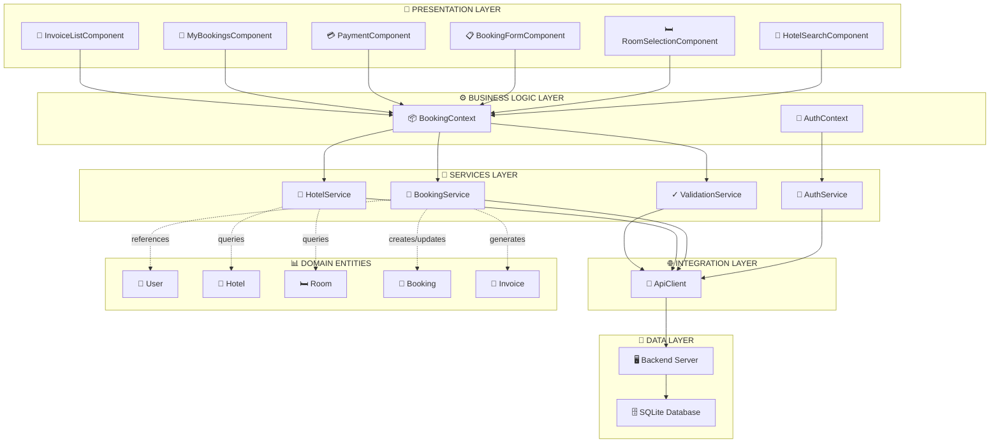
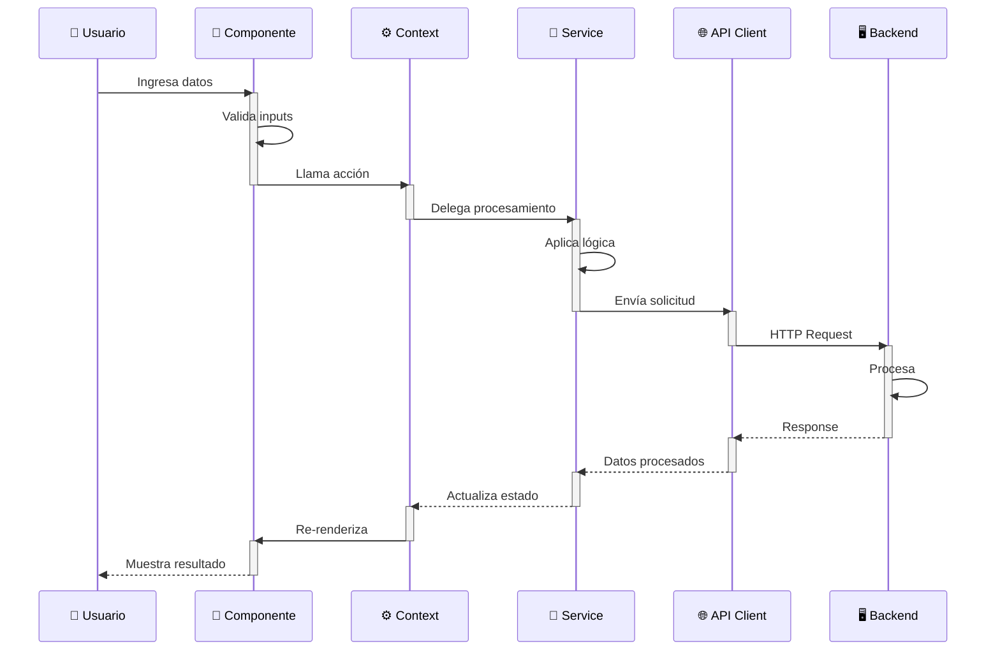

# Diagrama de Clases - ViniHotel Web Application

## Diagrama UML Completo

```mermaid
classDiagram
    %% ==========================================
    %% DOMAIN MODELS / ENTITIES
    %% ==========================================
    
    class User {
        -id: string
        -name: string
        -email: string
        -password: string
        -role: UserRole
        -phone?: string
        -address?: string
        -dateOfBirth?: string
        -nationality?: string
        -documentId?: string
        -createdAt: string
        +getUserRole(): UserRole
        +updateProfile(updates): void
    }
    
    class Hotel {
        -id: string
        -name: string
        -description: string
        -location: string
        -image: string
        -rating: number
        -amenities: string[]
        +getRating(): number
        +getAmenities(): string[]
        +getRooms(): Room[]
    }
    
    class Room {
        -id: string
        -hotelId: string
        -name: string
        -type: RoomType
        -price: number
        -capacity: number
        -image: string
        -amenities: string[]
        -available: number
        -status: RoomStatus
        +isAvailable(): boolean
        +checkAvailability(dates): boolean
        +getPrice(): number
    }
    
    class RoomType {
        <<enumeration>>
        SINGLE
        DOUBLE
        SUITE
        PENTHOUSE
    }
    
    class RoomStatus {
        -roomId: string
        -hotelId: string
        -roomName: string
        -status: StatusEnum
        -lastUpdated: string
        -assignedTo?: string
        -notes?: string
        +updateStatus(newStatus): void
        +getStatus(): string
    }
    
    class StatusEnum {
        <<enumeration>>
        AVAILABLE
        OCCUPIED
        CLEANING
        MAINTENANCE
    }
    
    class Booking {
        -id: string
        -hotelId: string
        -hotelName: string
        -roomId: string
        -roomName: string
        -checkIn: string
        -checkOut: string
        -guests: number
        -totalPrice: number
        -guestName: string
        -guestEmail: string
        -status: BookingStatus
        -paymentStatus: PaymentStatus
        -createdAt: string
        +calculateDuration(): number
        +calculateTotal(): number
        +cancel(): void
        +checkIn(): void
        +checkOut(): void
    }
    
    class BookingStatus {
        <<enumeration>>
        PENDING
        CONFIRMED
        CHECKED_IN
        CHECKED_OUT
        CANCELLED
    }
    
    class PaymentStatus {
        <<enumeration>>
        PENDING
        PAID
        REFUNDED
    }
    
    class Invoice {
        -id: string
        -bookingId: string
        -userId: string
        -hotelName: string
        -roomName: string
        -checkIn: string
        -checkOut: string
        -subtotal: number
        -taxes: number
        -total: number
        -paymentMethod: string
        -paymentStatus: PaymentStatus
        -issuedDate: string
        -additionalCharges: AdditionalCharge[]
        +calculateTotal(): number
        +calculateTaxes(): number
        +addCharge(charge): void
        +generatePDF(): void
    }
    
    class AdditionalCharge {
        -id: string
        -description: string
        -amount: number
        -date: string
        +getAmount(): number
    }
    
    class StaffMember {
        -id: string
        -name: string
        -position: string
        -hotelId: string
        -hotelName: string
        -email: string
        -phone: string
        -status: StaffStatus
        -hireDate: string
        -role: StaffRole
        -permissions: string[]
        +hasPermission(permission): boolean
        +updateStatus(newStatus): void
        +getRole(): StaffRole
    }
    
    class StaffStatus {
        <<enumeration>>
        ACTIVE
        INACTIVE
        ON_LEAVE
    }
    
    class StaffRole {
        <<enumeration>>
        ADMIN
        RECEPTIONIST
        MANAGER
        HOUSEKEEPING
    }
    
    class CleaningTask {
        -id: string
        -roomId: string
        -roomName: string
        -hotelId: string
        -hotelName: string
        -status: TaskStatus
        -priority: Priority
        -assignedTo?: string
        -createdAt: string
        -completedAt?: string
        -notes?: string
        +assignTo(staffId): void
        +markAsComplete(): void
        +updatePriority(priority): void
    }
    
    class TaskStatus {
        <<enumeration>>
        PENDING
        IN_PROGRESS
        COMPLETED
    }
    
    class Priority {
        <<enumeration>>
        LOW
        MEDIUM
        HIGH
    }
    
    %% ==========================================
    %% CONTEXT / STATE MANAGEMENT
    %% ==========================================
    
    class AuthContext {
        -user: User | null
        -isAuthenticated: boolean
        +login(email, password): boolean
        +logout(): void
        +register(data): boolean
        +updateProfile(updates): void
        +getCurrentUser(): User | null
    }
    
    class BookingContext {
        -bookings: Booking[]
        -invoices: Invoice[]
        +addBooking(booking): Booking
        +getUserBookings(): Booking[]
        +getAllBookings(): Booking[]
        +cancelBooking(id): void
        +updateBooking(id, updates): void
        +updateBookingStatus(id, status): void
        +updatePaymentStatus(id, status): void
        +checkIn(id): void
        +checkOut(id): void
        +createInvoice(booking): Invoice
        +getUserInvoices(): Invoice[]
    }
    
    %% ==========================================
    %% SERVICES / UTILITIES
    %% ==========================================
    
    class AuthService {
        -users: User[]
        +login(email, password): User | null
        +register(userData): User
        +logout(): void
        +updateProfile(userId, updates): User
        +validateCredentials(email, password): boolean
        +getCurrentSession(): User | null
    }
    
    class BookingService {
        -bookings: Booking[]
        -invoices: Invoice[]
        +createBooking(roomId, dates): Booking
        +updateBooking(id, updates): Booking
        +cancelBooking(id): void
        +getBookingByRoom(roomId): Booking[]
        +checkConflicts(roomId, dates): boolean
        +calculatePrice(roomId, nights): number
    }
    
    class HotelService {
        -hotels: Hotel[]
        -rooms: Room[]
        +getAllHotels(): Hotel[]
        +getHotelById(id): Hotel
        +searchHotels(filters): Hotel[]
        +getRoomsByHotel(hotelId): Room[]
        +getRoomById(id): Room
        +checkAvailability(roomId, dates): boolean
    }
    
    class ApiClient {
        -baseURL: string
        -token?: string
        -headers: object
        +get(endpoint): Promise
        +post(endpoint, data): Promise
        +put(endpoint, data): Promise
        +delete(endpoint): Promise
        +setToken(token): void
        +login(credentials): Promise
        +register(userData): Promise
        +getHotels(): Promise
        +createBooking(data): Promise
        +getBookings(): Promise
    }
    
    class ValidationService {
        +validateEmail(email): boolean
        +validatePassword(password): boolean
        +validateDateRange(checkIn, checkOut): boolean
        +validateNumberOfGuests(capacity, guests): boolean
        +validateBookingDates(checkIn, checkOut): boolean
    }
    
    %% ==========================================
    %% COMPONENTS (High-level)
    %% ==========================================
    
    class AppComponent {
        -routes: Route[]
        -theme: Theme
        +render(): JSX
        +initializeApp(): void
        +setupProviders(): void
    }
    
    class AuthLayout {
        -children: ReactNode
        +render(): JSX
        +handleLogin(): void
        +handleRegister(): void
    }
    
    class DashboardLayout {
        -user: User
        -sidebar: Component
        -content: Component
        +render(): JSX
    }
    
    class HotelSearchComponent {
        -hotels: Hotel[]
        -filters: SearchFilters
        -selectedHotel?: Hotel
        +search(filters): void
        +filterHotels(): Hotel[]
        +selectHotel(hotelId): void
    }
    
    class RoomSelectionComponent {
        -rooms: Room[]
        -selectedRoom?: Room
        -checkIn: string
        -checkOut: string
        +filterByDates(): Room[]
        +selectRoom(roomId): void
        +showDetails(roomId): void
    }
    
    class BookingFormComponent {
        -room: Room
        -user: User
        -booking: Booking
        -formData: object
        +handleSubmit(): void
        +calculateTotal(): number
        +validateDates(): boolean
    }
    
    class PaymentComponent {
        -invoice: Invoice
        -paymentMethod: string
        -cardData?: object
        +processPayment(): Promise
        +selectPaymentMethod(method): void
        +validatePayment(): boolean
    }
    
    class MyBookingsComponent {
        -bookings: Booking[]
        -filteredBookings: Booking[]
        +loadBookings(): void
        +filterBookings(status): void
        +cancelBooking(id): void
        +viewDetails(id): void
    }
    
    class InvoiceListComponent {
        -invoices: Invoice[]
        -selectedInvoice?: Invoice
        +loadInvoices(): void
        +downloadPDF(id): void
        +viewDetails(id): void
    }
    
    %% ==========================================
    %% RELATIONSHIPS
    %% ==========================================
    
    %% User relationships
    User "1" --> "*" Booking : creates
    User "1" --> "*" Invoice : owns
    User "1" --> "*" StaffMember : assigned as
    
    %% Hotel relationships
    Hotel "1" --> "*" Room : contains
    Hotel "1" --> "*" StaffMember : employs
    
    %% Room relationships
    Room "1" --> "*" Booking : reserved by
    Room "1" --> "1" RoomStatus : has
    Room "1" --> "*" CleaningTask : assigned
    
    %% Booking relationships
    Booking "1" --> "1" Invoice : generates
    Booking "1" --> "1" User : made by
    Booking "1" --> "1" Room : reserves
    Booking "1" --> "1" Hotel : at
    
    %% Invoice relationships
    Invoice "1" --> "*" AdditionalCharge : contains
    Invoice "1" --> "1" Booking : related to
    
    %% Context relationships
    AuthContext "1" --> "*" User : manages
    BookingContext "1" --> "*" Booking : manages
    BookingContext "1" --> "*" Invoice : manages
    
    %% Service relationships
    AuthService "1" --> "*" User : handles
    BookingService "1" --> "*" Booking : manages
    HotelService "1" --> "*" Hotel : retrieves
    HotelService "1" --> "*" Room : retrieves
    ApiClient "1" --> "*" AuthService : uses
    ApiClient "1" --> "*" BookingService : uses
    ApiClient "1" --> "*" HotelService : uses
    
    %% Component relationships
    AppComponent "1" --> "*" AuthLayout : contains
    AppComponent "1" --> "*" DashboardLayout : contains
    DashboardLayout "1" --> "1" HotelSearchComponent : contains
    DashboardLayout "1" --> "1" RoomSelectionComponent : contains
    DashboardLayout "1" --> "1" BookingFormComponent : contains
    DashboardLayout "1" --> "1" PaymentComponent : contains
    DashboardLayout "1" --> "1" MyBookingsComponent : contains
    DashboardLayout "1" --> "1" InvoiceListComponent : contains
    
    %% Service to Component
    HotelSearchComponent "1" --> "1" HotelService : uses
    RoomSelectionComponent "1" --> "1" HotelService : uses
    BookingFormComponent "1" --> "1" BookingService : uses
    PaymentComponent "1" --> "1" BookingService : uses
    MyBookingsComponent "1" --> "1" BookingContext : uses
    InvoiceListComponent "1" --> "1" BookingContext : uses
```

## Arquitectura de Capas

## Flujo de Datos Principal

## Notas Importantes

### Patrones de Diseño Utilizados:
1. **Context API** - Gestión de estado global (Auth, Bookings)
2. **Service Pattern** - Lógica de negocio separada (AuthService, BookingService)
3. **Component Composition** - Componentes reutilizables y modulares
4. **Repository Pattern** - ApiClient para acceso a datos

### Responsabilidades por Capa:
- **Presentación**: Renderizar UI, manejar eventos, validación básica
- **Negocio**: Estados globales, orquestación de operaciones
- **Servicios**: Lógica de negocio, transformación de datos
- **Integración**: Comunicación con backend
- **Datos**: Almacenamiento persistente

### Flujos Principales:
1. **Autenticación**: Login/Register → AuthService → ApiClient → Backend
2. **Búsqueda**: Filtros → HotelService → ApiClient → Backend
3. **Reserva**: Booking Form → BookingService → Invoice → Payment API
4. **Consulta**: MyBookings → BookingContext → LocalStorage/Cache
